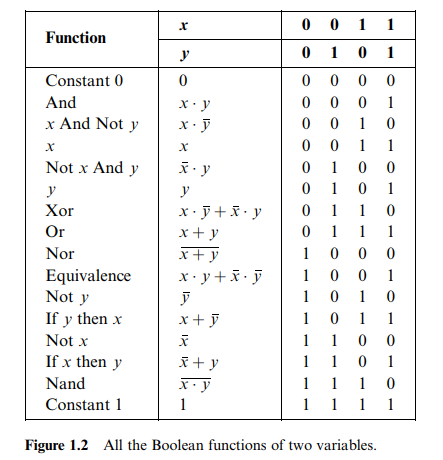
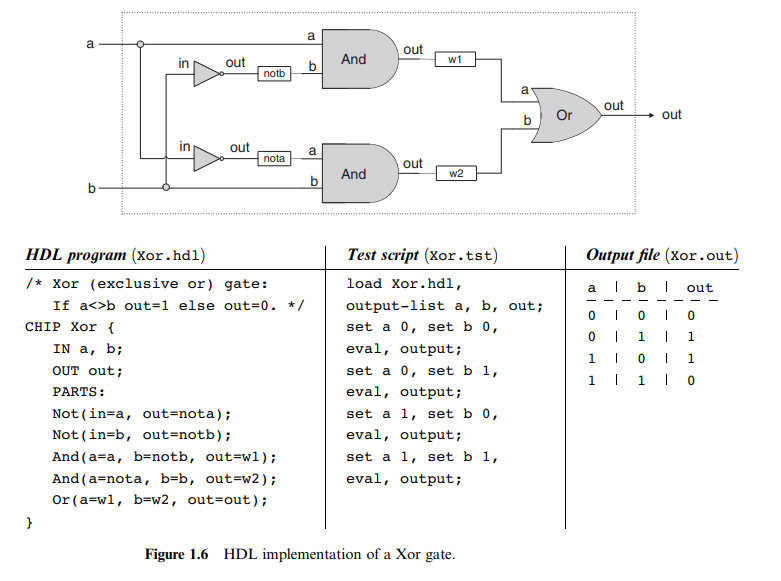

<!DOCTYPE html>
<html>
<head>
    <title>Page Title</title>
    
</head>
<body>
    <header>
        
        <h2>Nand2Teris</h2>
    </header>

## Boolean Logic

### Boolean Identities

- (x AND y) = (y AND x)
- (x OR y) = (y OR x) **Commutative law**
- (x AND (y AND z)) = ((x AND y) AND z)
- (x AND (y AND z)) = ((x AND y) AND z)**Associative law**
- (x AND (y OR z)) = ((x AND y) OR (x AND z))
- (x OR (y AND z)) = ((x OR y) AND (x OR z))**Distributive law**
- NOT(x AND y) = Not(x) OR NOT(y)
- NOT(x OR y) = NOT(x) AND NOT(y)**DE Morgan law**

### Boolean Function Synthesis
>**Theorem:**
>Any boolean function can be represented by only AND OR NOT operations

Then as `x OR y= NOT(NOT(x) AND NOT(y))` Then any boolean function can be represented only by AND and NOT.

### Hardware Description language

<footer>
    
&copy; 2024 ECE Department, University of Wisconsin-Madison. All rights reserved.

    
<a href="privacy.html">Privacy Policy</a> | <a href="terms.html">Terms of Use</a> | <a href="contact.html">Contact Us</a>

    </footer>
</body>
</html>
