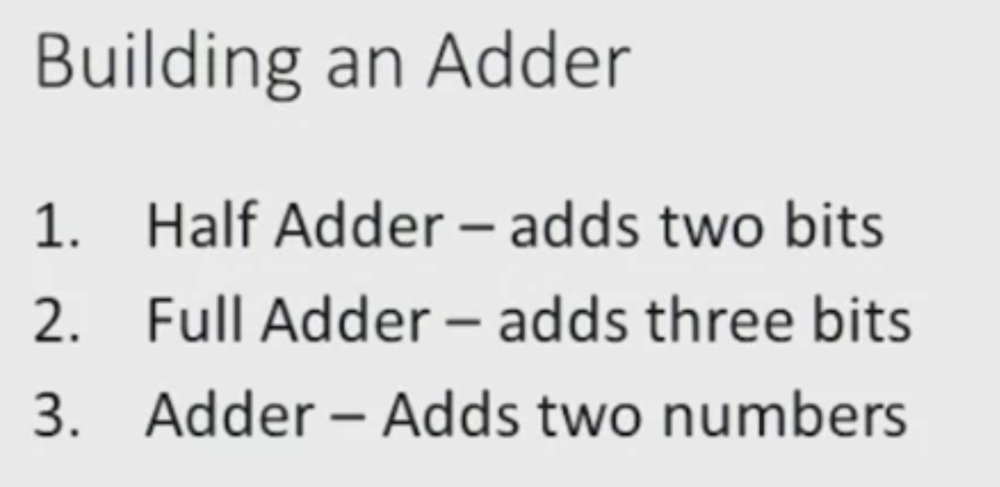
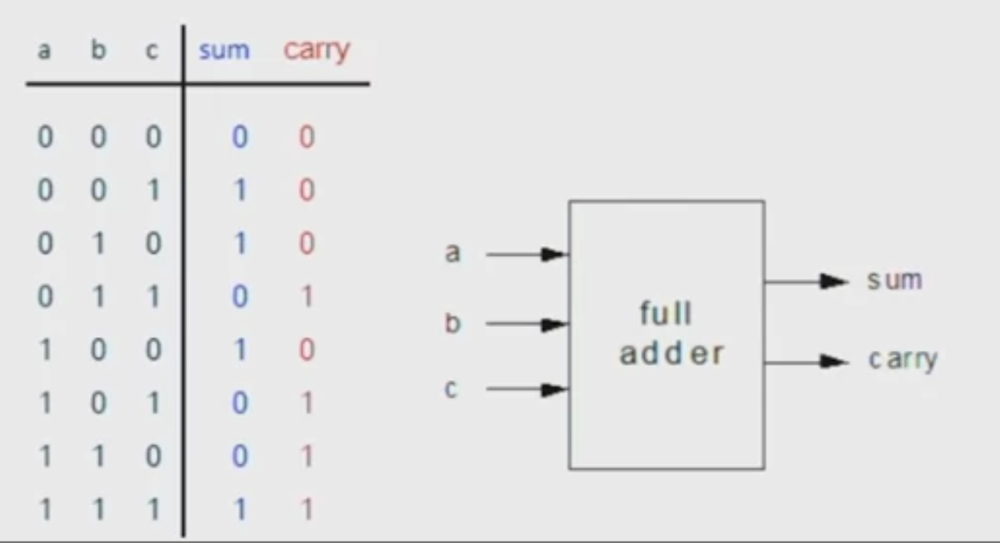
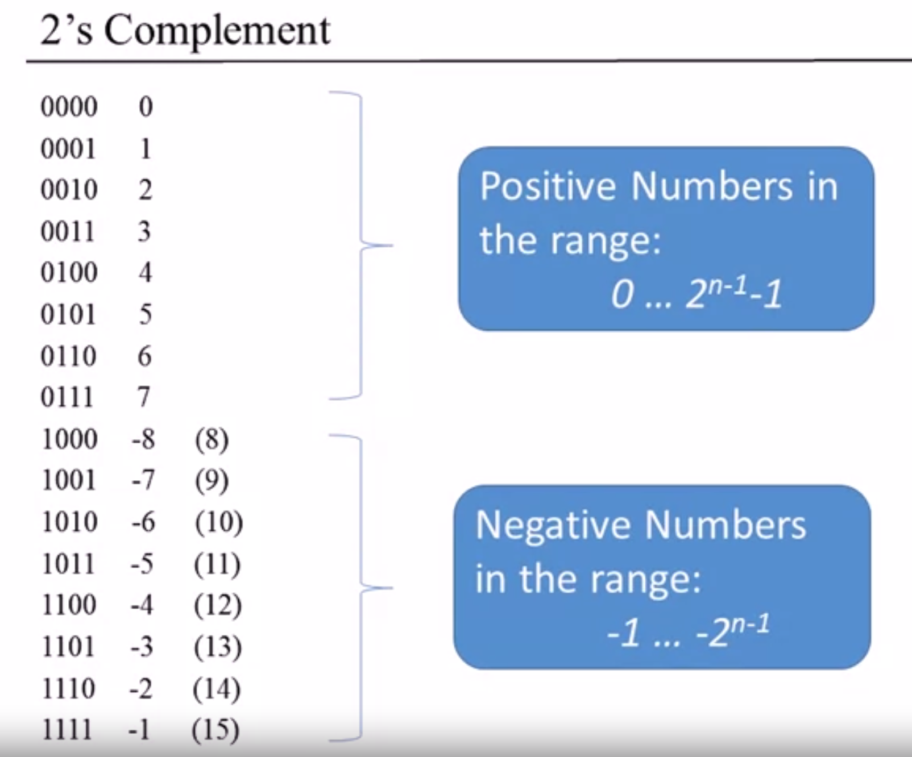
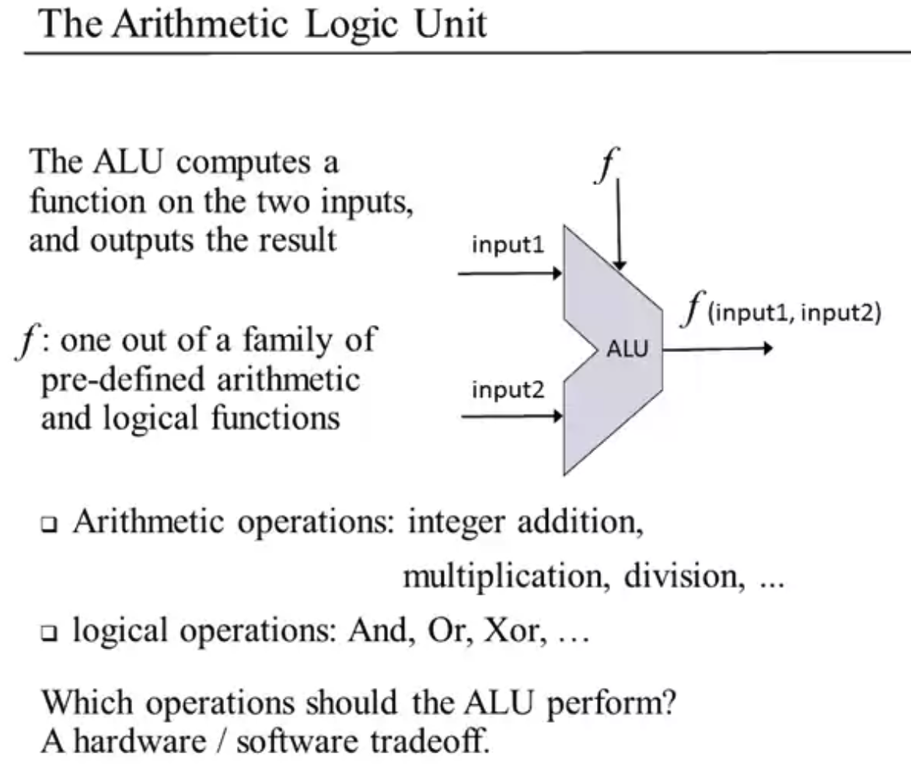

<!DOCTYPE html>
<html>
<head>
    <title>Page Title</title>
    
</head>
<body>
    <header>
        
        <h2> Nand2Teris </h2>
    </header>

## Boolean Arithmetic

### Perform Arithmetic Function in HDL
#### Binary Addition

Full adder has another input c as there is carry of the former bit

#### Negative Numbers

### Computer System
#### Von Neumann Architecture

#### Arithmetic Logical Unit

<footer>
    
&copy; 2024 ECE Department, University of Wisconsin-Madison. All rights reserved.

    
<a href="privacy.html">Privacy Policy</a> | <a href="terms.html">Terms of Use</a> | <a href="contact.html">Contact Us</a>

    </footer>
</body>
</html>
